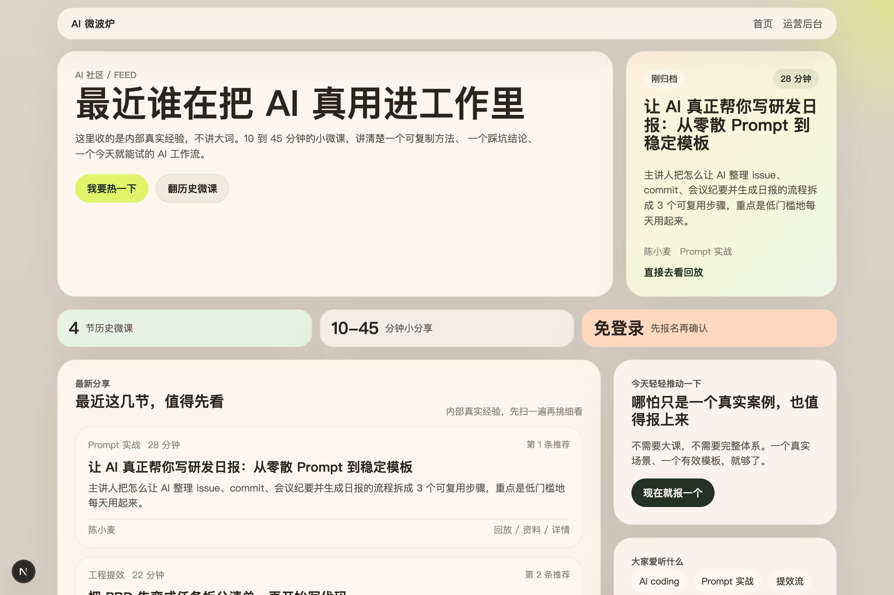
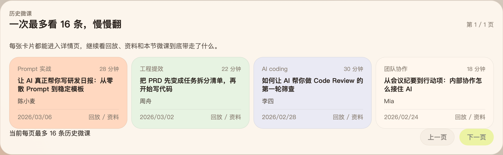
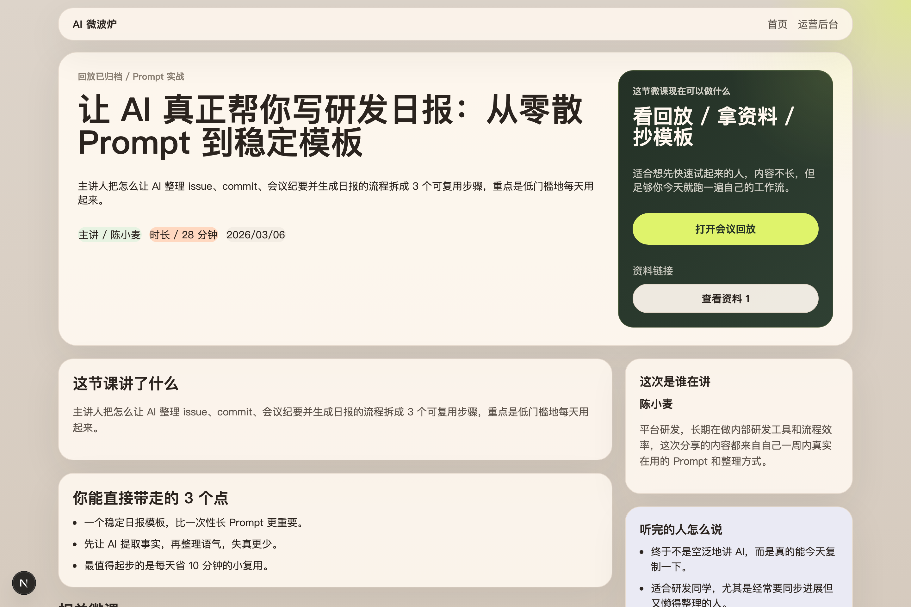
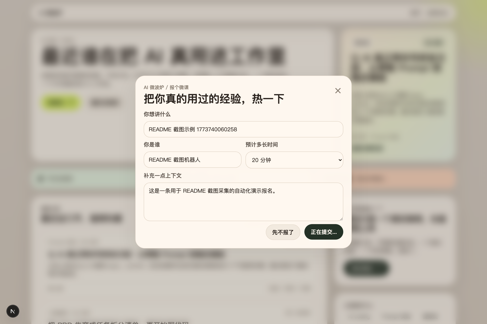
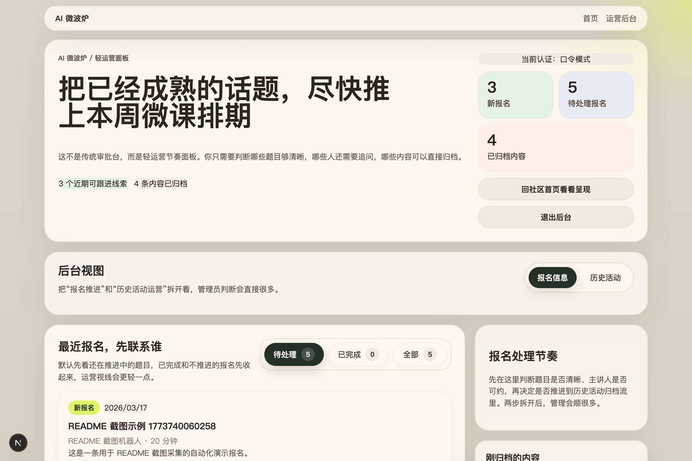
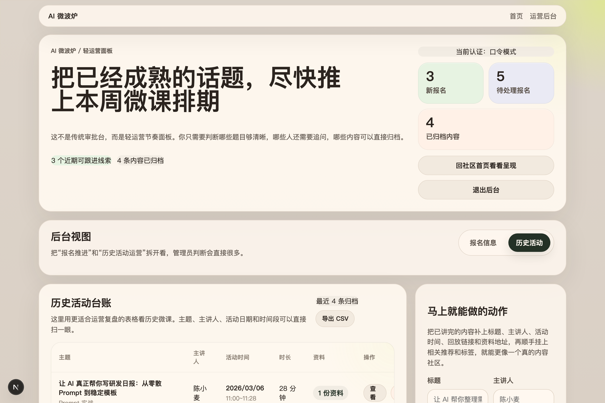

# AI 微波炉 / ai-microcourse-hub

让内部 AI 经验分享像热饭一样轻松。

`AI 微波炉` 是一个面向公司内部的微课社区：员工可以免登录报名分享 10~45 分钟的小课，管理员可以轻运营式地整理活动、归档视频与资料链接，团队成员则能像逛一个年轻、轻松的小社区一样持续吸收 AI 实战经验。

AI Microwave is a playful internal AI microcourse hub for lightning talk submissions, course archives, and lightweight community operations.

All names, links, and intranet URLs in this repository are demo placeholders for presentation purposes.

## Gallery / 页面预览



| Home Archive / 首页历史微课 | Course Detail / 微课详情页 |
| --- | --- |
|  |  |

| Success State / 报名成功页 | Admin Panel / 管理员后台 |
| --- | --- |
|  |  |



## Overview / 项目简介

- 中文：这是一个偏内部知识社区感的微课平台原型，不是传统培训系统
- English: A lightweight internal-learning community prototype rather than a conventional LMS
- 中文：重点在于降低分享门槛、沉淀真实经验、让管理员更容易轻运营
- English: It is built to lower sharing friction, preserve real AI workflows, and keep operations simple

## Highlights / 项目亮点

- 轻社区首页 / Community-style homepage with a lighter, more social tone
- 微课归档 / Archived microcourses with cards, pagination, detail pages, and related content
- 免登录报名 / Login-free talk submission flow for fast participation
- 轻运营后台 / Operator-friendly admin panel split into `报名信息` and `历史活动`
- 多资料链接 / Multiple material links per archived course
- 双认证模式 / `password` and `trusted_header` admin auth modes
- 开箱可演示 / Prisma + SQLite + seed data for immediate local demos

## Repo One-liner / 仓库一句话

适合作为 GitHub 仓库描述：

> A playful internal AI microcourse hub for talk submissions, course archives, and lightweight community operations.

## Pages / 页面一览

- `/`：社区首页，展示品牌氛围、近期微课、历史微课列表与报名入口
- `/micro-courses/[slug]`：微课详情页，查看视频回放、资料链接、讲师信息与相关推荐
- `/success`：报名成功与状态反馈页
- `/admin`：管理员轻运营面板，维护报名信息与历史活动

## Quick Start / 快速开始

最省事的方式：

```bash
npm run dev:up
```

这个命令会自动完成以下事情：

- 缺 `.env` / `.env.local` 时自动从示例文件创建
- 缺依赖时自动执行 `npm install`
- 自动执行 `npm run db:push`
- 只有数据库不存在时才自动灌入演示数据

启动后访问：

- 首页：`http://localhost:3000`
- 后台：`http://localhost:3000/admin`

默认管理员口令：

- `microwave-admin`
- 仅用于本地演示，正式环境请务必替换

如果你想手动启动：

```bash
npm install
cp .env.example .env
cp .env.example .env.local
npm run db:push
npm run db:seed
npm run dev
```

## Product-style Boot / 产品级一键启动

如果你是下载下来想直接把它像一个可运行产品一样拉起来，推荐：

```bash
npm run app:up
```

这个命令会自动：

- 自动补齐 `.env` / `.env.local`
- 自动安装依赖
- 自动执行 `db:push`
- SQLite 首次启动时自动灌入演示数据
- 自动构建生产包
- 自动以后台方式启动应用
- 自动做 `/api/health` 健康检查

常用命令：

```bash
npm run app:up
npm run app:status
npm run app:logs
npm run app:down
npm run app:restart
```

默认会启动在：

- `http://127.0.0.1:3000`

也支持临时指定端口：

```bash
APP_PORT=3200 npm run app:up
```

运行日志和 PID 会放在：

- `.runtime/app.log`
- `.runtime/app.pid`

## Feature Set / 功能能力

- 历史微课卡片列表，每页最多展示 16 条
- 历史微课详情页，支持多个资料链接与录播链接展示
- 免登录报名表单与成功反馈页
- 管理员查看报名、标记完成、隐藏历史报名
- 管理员发布历史活动，维护主题、讲师、日期、起止时间、资料链接
- 后台表格化运营视图，便于按主题、讲师、时间管理内容
- `GET /api/health` 健康检查接口

## Screenshot Workflow / README 截图采集

为了方便你继续完善 GitHub 首页，我补了一条一键截图命令：

```bash
npm run screenshots:readme
```

这个脚本会自动：

- 在隔离的 SQLite 临时库里执行 `db:push` 和 `db:seed`
- 默认启动一个本地服务在 `http://127.0.0.1:3100`
- 用 Playwright 采集 6 张 README / Release 常用截图
- 输出到 `artifacts/readme-screenshots`

它不会覆盖你当前 `prisma/dev.db` 里的本地数据。

默认生成：

- `01-home-hero.png`
- `02-home-archive-grid.png`
- `03-course-detail.png`
- `04-submit-success.png`
- `05-admin-submissions.png`
- `06-admin-history-table.png`

如果你想把最新截图同步到仓库展示目录，可以直接覆盖：

```bash
mkdir -p docs/screenshots
cp artifacts/readme-screenshots/*.png docs/screenshots/
```

如果你已经手动启动了服务，也可以复用现成地址：

```bash
README_SCREENSHOT_BASE_URL=http://127.0.0.1:3000 npm run screenshots:readme
```

## Tech Stack / 技术栈

- `Next.js 15` + `React 19`
- `Prisma`
- `SQLite`
- `Playwright`
- `TypeScript`

## Commands / 常用命令

```bash
npm run dev:up
npm run app:up
npm run app:status
npm run app:logs
npm run app:down
npm run app:restart
npm run dev
npm run build
npm run lint
npm run db:push
npm run db:seed
npm run screenshots:readme
npm run test:e2e
npm run test:e2e:sso
npm run test:e2e:all
```

## Admin Auth / 管理员认证模式

### `password`

默认使用口令模式。

```env
ADMIN_AUTH_MODE="password"
ADMIN_PASSWORD="microwave-admin"
```

### `trusted_header`

适合接公司内网网关、SSO 或反向代理，由上游透传已认证用户信息。

```env
ADMIN_AUTH_MODE="trusted_header"
ADMIN_TRUSTED_HEADER="x-internal-user"
ADMIN_TRUSTED_USERS="alice,bob,charlie"
```

如果 `ADMIN_TRUSTED_USERS` 为空，则任何带该 header 的请求都能进入后台；正式环境不建议这样配置。

## Deploy / 部署方式

### Node 部署

```bash
npm install
npm run db:push
npm run build
npm run start
```

### Docker 部署

```bash
docker compose up --build
```

部署前建议至少配置：

- `DATABASE_URL`
- `ADMIN_AUTH_MODE`
- `ADMIN_PASSWORD`
- `ADMIN_TRUSTED_HEADER`
- `ADMIN_TRUSTED_USERS`

## Testing / 测试

普通口令模式：

```bash
npm run test:e2e
```

trusted header 模式：

```bash
npm run test:e2e:sso
```

全部回归：

```bash
npm run test:e2e:all
```

## Release Assets / GitHub 发布资料

- 首个 release 文案：`docs/release/first-release.md`
- GitHub Release 直贴版：`docs/release/github-release-v0.1.0.md`
- 开源前说明：`docs/release/open-source-note.md`
- 截图清单：`docs/release/screenshots-checklist.md`
- README 展示截图：`docs/screenshots/`
- 版本变更记录：`CHANGELOG.md`

## Structure / 目录结构

- `src/app`：页面与 API 路由
- `src/components`：前端交互组件
- `src/lib`：数据聚合、Prisma、权限与工具函数
- `prisma/schema.prisma`：数据模型定义
- `prisma/seed.mjs`：演示数据
- `scripts/dev-up.sh`：一键本地启动脚本
- `scripts/capture-readme-screenshots.mjs`：README 截图采集脚本

## Use Cases / 适用场景

- 企业内部 AI 学习分享社区
- 内部技术午餐会 / 闪电分享 / 微课归档平台
- 轻量运营型知识社区原型

## Roadmap / 后续建议

如果准备正式内网长期使用，建议继续升级：

- `PostgreSQL`
- 正式 SSO 登录
- 管理员权限分层
- 上传文件对象存储
- 运营数据看板与留存统计

## License / 许可证

This project is released under the `MIT` License.

详见 `LICENSE`。
